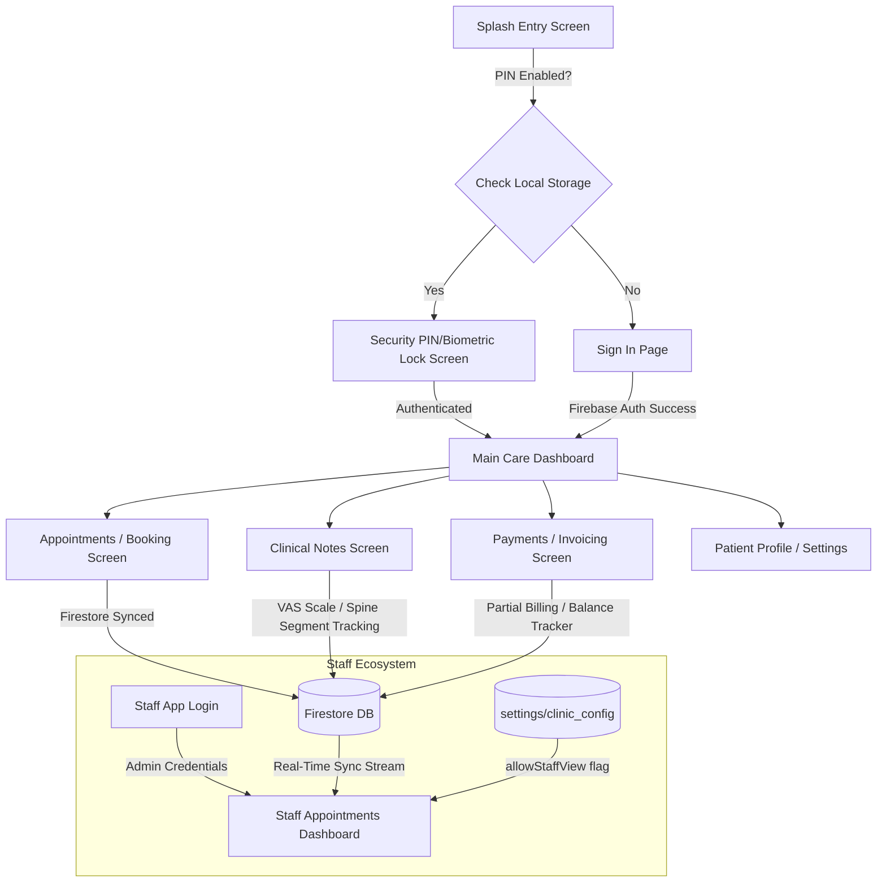
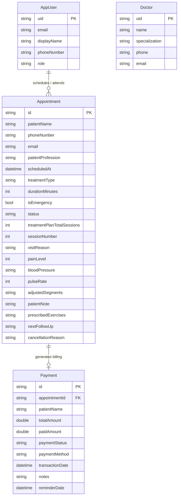

# Gonstead Chiropractic Treatment (GCT) System

A premium clinic management ecosystem built with Flutter. It consists of the primary **Doctor & Patient Administration App** and a specialized, offline-first **Staff Portal** (`gct_staff`).

The app uses a modern **"Teal Frost & Icy Slate"** visual branding system (Primary: `#0E7490`, Scaffold Light: `#F8FAFC`, Surface Dark: `#1E293B`) to reduce fatigue and deliver a clean, professional clinical aesthetic.

---

## 🏗 System Architecture & Logic Flow



---

## 📊 Entity Relationship Diagram (ERD)



---

## 🛠 Core Feature Mechanics

### 1. Security & Lock Flow
- **PIN Lock Screen:** Enforces biometric scan (`local_auth`) and custom 4-digit PIN access upon app cold start and resumption.
- **Biometric Integration:** Integrates dynamically, aligning with the primary branding color theme.

### 2. Clinical Notes & Spinal Assessment
- **VAS (Visual Analogue Scale):** Dynamic pain scale tracking from 0 to 10.
- **Spine Segment Highlighter:** Identifies specific subluxation segments (Cervical, Thoracic, Lumbar, Sacrum/Pelvis) for adjustments, which is serialized directly into Firestore.
- **PDF Report Generation:** Generates comprehensive PDF reports with embedded digital doctor stamps for sharing via email/messages.

### 3. Billing & Partial Payments
- **Payment Lifecycle:** Tracks `totalAmount` versus `paidAmount` to dynamically update payment status as `paid`, `partially_paid`, or `unpaid`.
- **Scheduled Reminders:** Allows staff to set follow-up reminder dates for outstanding balances, showing banners on the dashboard for quick tracking.

### 4. Admin-Staff Portal Isolation
- **Staff Access:** Staff members login through the `gct_staff` app using restricted credentials.
- **Master Kill Switch:** The doctor can toggle the `allowStaffView` property inside `settings/clinic_config` in real time. If disabled, all staff devices instantly show an "Access Suspended" warning overlay.

---

## 📂 Project Directory Structure

```text
gct/
├── assets/                     # App assets (Clinical logos, digital stamps)
├── lib/
│   ├── src/
│   │   ├── app.dart            # Routing and Material application setup
│   │   ├── models/             # Shared data models (AppUser, Appointment, Payment)
│   │   ├── services/           # Global notifications, Firestore repositories
│   │   ├── theme/              # Centralized Teal Frost brand styling & ThemeMode state
│   │   └── features/
│   │       ├── auth/           # Login, Forgot PW, PIN setup, Lock Screen
│   │       ├── appointments/   # Booking flows, details, and PDF generators
│   │       ├── dashboard/      # Premium overview metrics and notifications
│   │       ├── notes/          # Spine segment mapping and clinic history logs
│   │       ├── payments/       # Ledger logs and payment dialog entries
│   │       ├── calculator/     # Quick cost and invoice calculator
│   │       └── analytics/      # Patient charts and reporting metrics
│   └── main.dart               # Main App initialization & Firebase loading
│
└── gct_staff/                  # Staff Portal application
    ├── assets/                 # Copy of shared logo and branding assets
    └── lib/
        ├── src/
        │   └── screens/        # Staff Login & Stream-based Appointments list
        └── main.dart           # Staff App routing and custom styling
```

---

## 🚀 Getting Started

### Prerequisites
- Flutter SDK (v3.0.0 or higher)
- Android Studio or Xcode
- Active Firebase project console configuration

### Main App Setup
1. Configure Firebase in the root folder via FlutterFire CLI or copy configuration files:
   - Android: `android/app/google-services.json`
   - iOS: `ios/Runner/GoogleService-Info.plist`
2. Fetch dependencies:
   ```bash
   flutter pub get
   ```
3. Run the application:
   ```bash
   flutter run
   ```

### Staff App Setup
1. Navigate to the staff folder:
   ```bash
   cd gct_staff
   ```
2. Restore packages:
   ```bash
   flutter pub get
   ```
3. Deploy to device:
   ```bash
   flutter run
   ```
